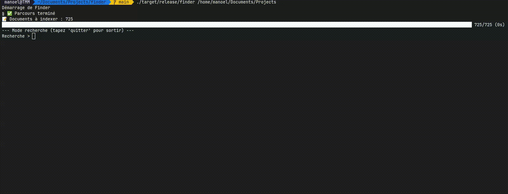

# Finder - Outil d'indexation et recherche de documents

 

Un outil en Rust pour indexer et rechercher dans des documents textuels (PDF, TXT, etc.) avec :
- Indexation rapide avec Tantivy
- Recherche en temps réel
- Interface en ligne de commande interactive

## Fonctionnalités

- Indexation récursive de répertoires
- Support des formats : PDF, TXT, MD, HTML,LOG etc.
- Filtrage des fichiers ignorés (binaires, images, etc.)
- Barres de progression et indicateurs visuels
- Recherche full-text avec scores de pertinence

## Installation

1. Installez Rust :
```bash
curl --proto '=https' --tlsv1.2 -sSf https://sh.rustup.rs | sh
```

2. cloner le projet : 
```bash
git clone https://github.com/tm-squaredfinder.git
cd finder
```
3. construire le projet
```bash
cargo build --release
```

## Utilisation

1. indexation
```bash
./target/release/finder /chemin/vers/dossier1 /chemin/vers/dossier2
```
ou en mode interactif

```bash
./target/release/finder
```

2. Recherche

Après l'indexation, entrez vos termes de recherche :
 ```text
 Recherche > Rust AND programmation
 ```

# Guide de Contribution

Pour contribuer à ce projet, suivez ces étapes :

1.  **Forkez le dépôt.**
2.  **Clonez votre fork :** `git clone URL_DE_VOTRE_FORK`.
3.  **Créez une branche :** `git checkout -b nom-de-votre-branche`.
4.  **Effectuez vos modifications.**
5.  **Committez :** `git commit -am 'Description concise de vos changements'`.
6.  **Pushez votre branche :** `git push origin nom-de-votre-branche`.
7.  **Créez une Pull Request** depuis GitHub.